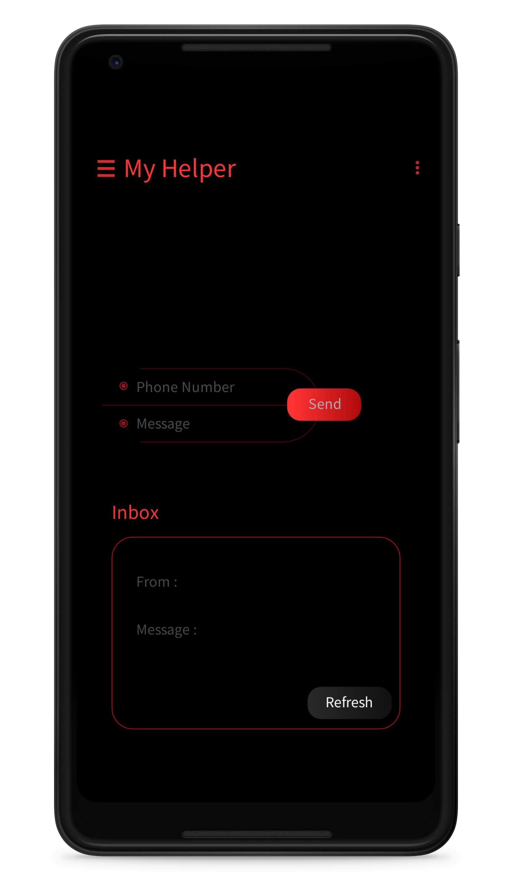
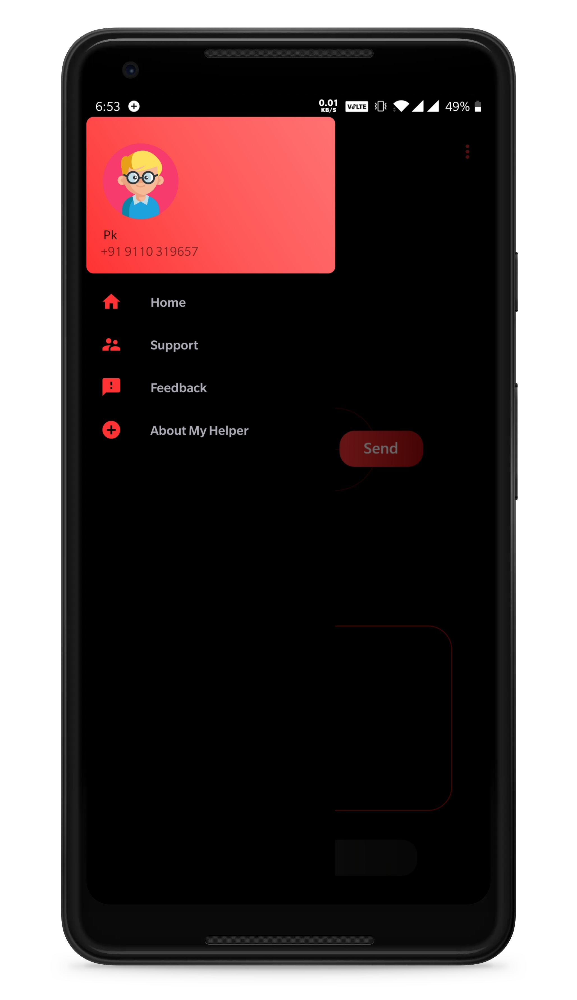
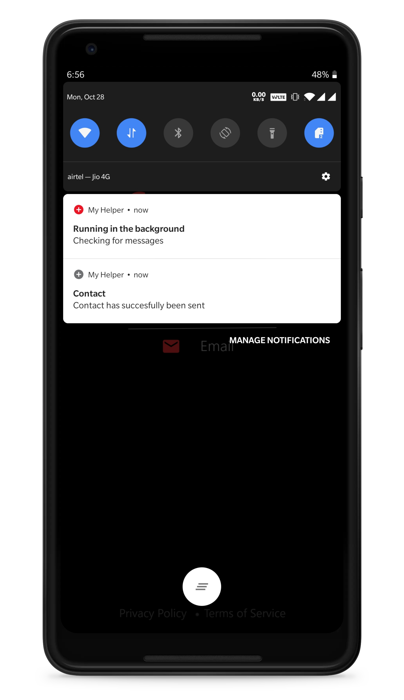

# MyHelper



This is an android application which solves 4 basic problems that every smartphone user face<br>

<b>Problem 1:</b> Forgot your phone at home? Want to get the contact’s number to make an important call?<br>
<b>Solution 1:</b> Just send an sms to your phone with contact name and you will get number back as an sms.<br>

<b>Problem 2:</b> Did you ever misplace your phone at home and you made the whole world upside down to search for it? <br>
<b>Solution 2:</b> MyHelper will help you change the sound profile of the phone from silent to normal mode so you could search for it easily.<br>

<b>Problem 3:</b> Lost your phone want to know where is it exactly?<br>
<b>Solution 3:</b> MyHelper will send you an sms with your phones current location immediately.<br>

<b>Problem 4:</b> Want to lock your phone?<br>
<b>Solution 4:</b> MyHelper will help you lock your screen immediately

<b>Hardware Requirements<b>
```
RAM - 2GB
Disk Space - 40 MB
```
<b>Software Requirements<b>
```
Supporting Operating Systems: Android (5.1.1 or above)
```
